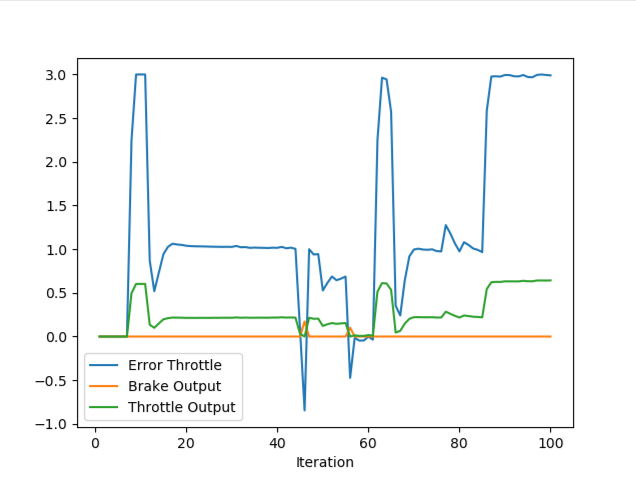

## Carla Screenshots - Step 1


Step 1 works as expected. Code compiles and runs successfully. Car is not moving.


## Step 2 - Throttle PID tuning
error during tuning runs saved in throttle_pid_data.txt and steer_pid_data.txt are saved in "./project/tuning_run_logs"

### Run 1
I did run the the Throttle PID with conservative parameters: `kpt = 0.1`, `kit = 0.00`, `kdt = 0.01`

I have seen:
- consistent steady-state error around 1.8-2.0
- no oscillations
- throttle output values around 0.2, around 10% of the error

Next:
- try increasing kpt (to 0.2) as my proportional gain is clearly too low. The ego does not reach target speeds.
- try adding small kit (0.001) to accumulate and eliminate steady-state error over time.
- increasing kdt to 0.02 to provide better damping for the increased kpt.

### Run 2
I did run the the Throttle PID with parameters: `kpt = 0.2`, `kit = 0.001`, `kdt = 0.02`

It proved good enough:
- quick response without excessive overshoot
- good steady-state tracking around 3.0 m/s
- minimal oscillations


## Step 3 - Steer PID tuning

I have executed 4 total tuning runs with the following parameters. The throttle consistently worked well with the previous params through all runs.


Tuning Steering proved more challenging compared to throttle. It was not only about tuning, but behaviour - more on that later.

_Parameters_
```cpp
double kps = 0.35;    // run1  0.25     // run2  0.4    // run3  0.5    // run4  0.35
double kis = 0.003;   // run1  0.001    // run2  0.0    // run3  0.005  // run4  0.003
double kds = 0.025;   // run1  0.02     // run2  0.08   // run3  0.04   // run4  0.025
```

_Tuning runs overview_
- Run 1: Steering oscillation, large swings, instability, slow steering response.
- Run 2: No wild oscillations (better damping), still slow response, steady state offset of (0.0036).
- Run 3: Over-dumped response, slow to settle (60-80 steps). Steady state offset of (0.0036). Insufficient aggressiveness?
- Run 4: See below with plots.


**Run 2 _ Start**


**Run 2 _ Ego avoided obstacle.**


**Run 4 _ Start**


**Run 4 _ Ego avoided obstacle.**


**Run 4 _ Ego overshoots, fails to recover.**

## Behaviour issues

On all my runs, I have observed my car struggling to recover after avoiding the first car in the same lane. Instead of properly recovering and continuing its trajectory forward, the ego car often kept steering left. It recovered so slow that it even went on the curb, or collided with the next (parking) car on the leftmost lane in the scene.

I wonder this could be a _*path planning/reference trajectory issue*_ instead of PID tuning problem? At the logs, after step 16 when the ego car should steer right to recover from the left turn.

In detail:
- step 1-16 : Initial Left turn : negative steering errors, indicating need to turn Left, which is correct
- step 17-19 : Transition point : growing positive errors (+0.049, +0.152, +0.173) indicating the car should initiate turning Right
- step 20-21 : Low errors
- step 22-37 : Negative errors : (-0.067 to -0.209 @ 28) the error show commanding an increasingly aggressive Left turn, when the car should in reality, turn Right. I believe this clearly shows something is going on with the updated path planning.


## Analyzing a plots (run 4).

I am analysing the plots strictly from a PID tuning perspective, ignoring the behaviour issues outlined above.

### Throttle error

params : : `kpt = 0.2`, `kit = 0.001`, `kdt = 0.02`



Stability: Great - very stable throughout the run
Response Speed: Fast initial response - reaches target velocity by step 8-10
Steady-State Tracking: Outstanding - maintains target velocity consistently (errors near 0)
Error Range: Minimal (mostly 0 to 1.11), indicating excellent velocity control
Disturbance Rejection: Good recovery from brief negative spike at step 45

### Steer error

params : `kps = 0.35`, `kis = 0.003`, `kds = 0.025`


Stability: Good - no wild oscillations like earlier runs
Response Speed: Improved - settling occurs in ~30-40 steps vs previous 60-80
Steady-State Error: Eliminated - no consistent bias like the previous 0.036 offset
Damping: Well-balanced - no overshoot/undershoot cycles
Error Magnitude: Reasonable range (-0.301 to +0.172), suggesting appropriate gain scaling


## Recognize the action of each part of the PID controller.

_*What is the effect of the PID according to the plots, how each part of the PID affects the control command?*_
_*Explain the different parts of the PID. (a.k.a. P / I / D )*_

PID stands for Proportional Integral Derivative controller.

The P proportional component provides immediate response propoertinal to current error. When the steering error jumps (like ste 16-17 from -0.036 to +0.049) the P component immediately provides corrective response. Large errors product stronger control commands, but alone causes steady-state error and potential oscillations.

The I integral component eliminates steady-state error, by accumulating error over time. It slowly builds up correction for persistent error over time. I used this to eliminate persistent steering error of -0.036 of my earlier tuning runs.

The D derivative component provides dampening by opposing rapid changes in error. It prevents overshoots and reduces oscillations. If too high, it can make response sluggish.

The three components work together: P provides quick response to current error, I eliminates long-term bias, and D smooths the response to prevent oscillations.

## How would you design a way to automatically tune the PID parameters?

We could implement a twiddle algorithm, as though in the course materials. The twiddle algorithm systematically adjusts each PID parameter by small increments and decrements, evaluating performance through simulation runs with a cost function that combines cross-track error, steering oscillation, and settling time. It keeps parameter changes that improve performance and reverses those that worsen it, gradually reducing step sizes until convergence. This method is computationally efficient and well-suited for simulation environments, though it can get trapped in local optima and requires careful cost function design.

Alternatively, we could also use genetic algorithms for tuning. Genetic algorithms evolve populations of PID parameter sets over multiple generations, using crossover and mutation operations to explore the parameter space broadly. This approach excels at avoiding local optima and can handle complex, multi-modal cost landscapes effectively. However, genetic algorithms require significantly more computational resources due to the need to evaluate many parameter combinations per generation, making them slower to converge than gradient-based methods.

For practical deployment, the cost function should combine multiple performance metrics with appropriate weightings, and parameter bounds should be enforced to prevent unstable behavior. Testing across various driving scenarios (straight roads, curves, obstacle avoidance) ensures robust parameter selection that generalizes well to different conditions.


## Model-Free vs Model-Based controllers

_*PID controller is a model free controller, i.e. it does not use a model of the car. Could you explain the pros and cons of this type of controller? Find at least 2 pros and cons for model free versus model based.*_

### Model-Free Controller Advantages
Model-free controllers like PID are simple to implement and tune without requiring detailed knowledge of the vehicle's dynamics, making them practical for rapid deployment across different car types. They are inherently robust to modeling errors and uncertainties since they don't rely on mathematical representations that may not perfectly capture real-world behavior.

### Model-Free Controller Disadvantages
PID controllers can only react to errors after they occur, leading to slower response times and potential instability in highly dynamic situations compared to predictive approaches. They often require extensive manual tuning for each specific application and may not achieve optimal performance since they lack understanding of the system's underlying physics.

### Model-Based Controller Advantages
Model-based controllers can predict future system behavior and proactively adjust control inputs, leading to superior performance and faster response times. They can systematically incorporate physical constraints and optimize control strategies based on mathematical understanding of vehicle dynamics.

### Model-Based Controller Disadvantages
These controllers are highly sensitive to modeling errors and may perform poorly if the mathematical model doesn't accurately represent the real system. They require significant expertise to develop accurate models and are computationally more demanding, making them complex to implement and maintain.